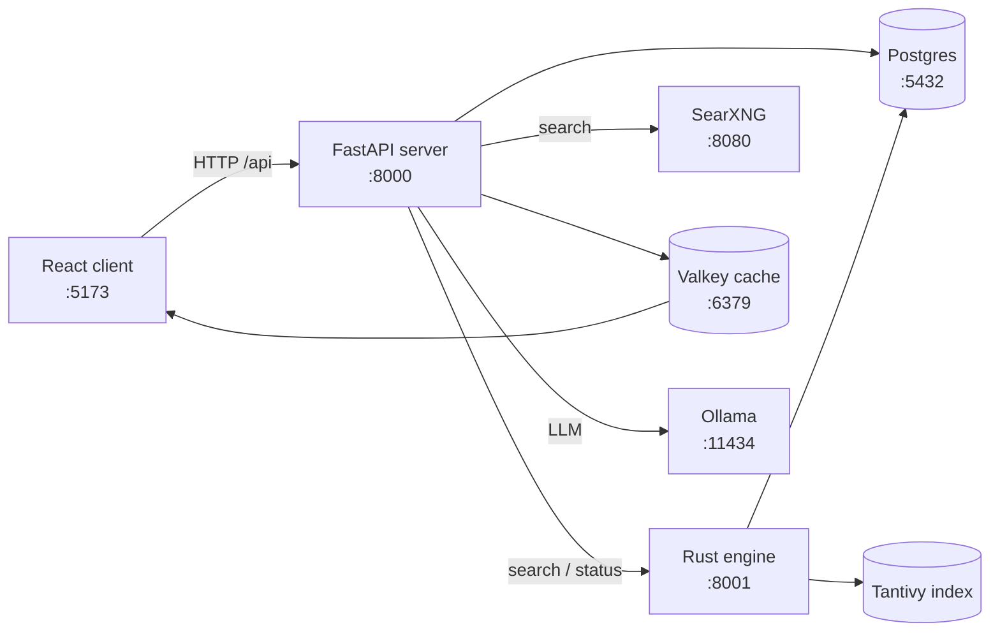

# QWRY — Self-Hosted Search & Research Engine

QWRY is a self-hosted search engine that combines **SearXNG metasearch**, a **local Rust-powered
crawl-and-index engine**, and an **AI research workspace** into one cohesive tool. Search the web,
save results into workspaces, annotate them in a station, and organize them on a visual canvas.


*<TBD: screenshot>*

## Features

- **Unified search** — SearXNG web results + local BM25 / vector / hybrid index, merged in one UI
- **AI overviews** — short answers, elaborate overviews, and study reports (via Ollama)
- **Workspaces** — drag-and-drop or bulk-transfer results; persist, summarize, and chat about them
- **Station** — reads, highlights, notes, pins, images, videos, tags, and comparisons
- **Canvas** — visual mind-map of your sources, notes, and media
- **Reader & Summarizer** — article / image / video extraction and LLM summaries
- **Profiles & history** — per-session profiles with search, read, and summary history
- **Self-hosted** — everything runs locally; no third-party API keys required for search

## Quick start

Prerequisites: **Python ≥ 3.13, Rust, Docker, Ollama** (details in
[getting-started](docs/getting-started.md)).

```bash
git clone <repo-url> qwry && cd qwry
cp .env.example .env        # review the defaults
./launch.sh --all           # SearXNG + engine + server + frontend
```

Then open **http://127.0.0.1:5173**. Stop everything with `./shutdown.sh`
(Windows: `launch.bat --all`).

> Demo: <video controls width="720" src="docs/assets/videos/quickstart-launch.mp4">
>   <a href="docs/assets/videos/quickstart-launch.mp4">Download quickstart demo</a>
> </video>
> *<TBD: video>*

## Architecture at a glance



Three coordinated tiers: a **React frontend**, a **FastAPI backend** that orchestrates search and
persistence, and a **Rust crawler + Tantivy indexer** (serving on :8001) that builds a local
index of crawled pages. **SearXNG** supplies live metasearch results. Full detail in
[architecture](docs/architecture.md).

## Tech stack

| Layer | Tech |
|---|---|
| Frontend | React 19, Vite, Zustand, Tailwind 4, dnd-kit |
| Backend | Python 3.13, FastAPI, SQLAlchemy, Alembic |
| Search engine | Rust, Tantivy (BM25), BGE embeddings, hybrid fusion |
| Data stores | Postgres, Valkey (Redis-compatible cache) |
| AI | Ollama (e.g. `gemma3:1b`) |
| Metasearch | SearXNG (Docker) |

## Documentation

| Doc | What you'll learn |
|---|---|
| [Getting Started](docs/getting-started.md) | Prerequisites, first run, verification |
| [Usage Guide](docs/usage.md) | Search, workspaces, station, canvas, chat |
| [Architecture](docs/architecture.md) | System design, data flow, topology |
| [Server](docs/server.md) | FastAPI backend internals & services |
| [Engine](docs/engine.md) | Rust crawler + indexer internals |
| [Client](docs/client.md) | React frontend structure & state |
| [API Reference](docs/api-reference.md) | All REST endpoints |
| [Database](docs/database.md) | Models, ERD, migrations |
| [Configuration](docs/configuration.md) | Env vars, CLI flags, qwry.toml |
| [SearXNG](docs/searxng.md) | SearXNG integration & setup |
| [Deployment](docs/deployment.md) | Running in production |
| [Security](docs/security.md) | Session model & known gaps |
| [Troubleshooting](docs/troubleshooting.md) | Common issues & fixes |
| [Known Issues](docs/known-issues.md) | Current bugs & limitations |
| [Development](docs/development.md) | Tests, linting, contributing |

Full index: [docs/README.md](docs/README.md).

## Status

Early-stage (`0.1.0`). See [known-issues](docs/known-issues.md) for current gaps (e.g. missing
Alembic migrations for newer tables, session-ownership gaps, dead code).
