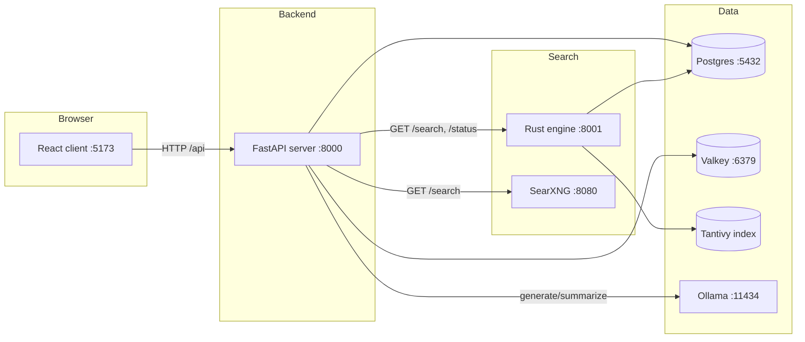
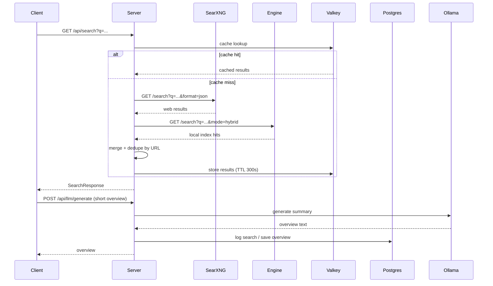
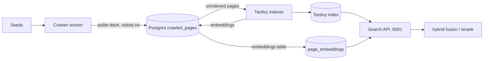

# Architecture

> **Audience:** developers | **Status:** complete
> **Source of truth:** `server/src`, `engine/*`, `client/src`, `infra/docker-compose.yml`

This document describes the overall system design: components, ports, data flow, and the lifecycle
of a search query. See [server](server.md), [engine](engine.md), and [client](client.md) for the
per-tier internals.

---

## Overview

QWRY is a three-tier system plus supporting infrastructure:

1. **React client** (`client/`, port 5173) — browser UI with search, workspaces, station, canvas,
   reader, and summarizer views.
2. **FastAPI server** (`server/`, port 8000) — orchestrates search, persists data to Postgres,
   caches to Valkey, and calls Ollama for LLM features.
3. **Rust engine** (`engine/`, port 8001) — a polite web crawler plus a Tantivy-based indexer that
   exposes BM25 / vector / hybrid search over crawled pages.
4. **SearXNG** (`infra/`, port 8080) — metasearch aggregator providing live web results, images,
   videos, news, suggestions, and infoboxes.

*<TBD: screenshot>*

## Component diagram

## Ports

| Port | Service | Config |
|---|---|---|
| 5173 | Vite dev server (client) | `FRONTEND_PORT` |
| 8000 | FastAPI server | `HOST` / `PORT` |
| 8001 | Rust engine indexer | `ENGINE_PORT` |
| 8080 | SearXNG | `SEARXNG_PORT` |
| 6379 | Valkey (Redis-compatible) | `VALKEY_PORT` |
| 5432 | PostgreSQL | `DATABASE_URL` |
| 11434 | Ollama | `OLLAMA_BASE_URL` |

## Search data flow

Provider selection is controlled by the `provider` query param (`searxng` | `engine` | `hybrid` |
`all`) or the `DEFAULT_SEARCH_PROVIDER` env var. The hybrid path runs both providers concurrently and
merges by URL (`server/src/services/search_orch.py`).

## Crawl → index → search lifecycle

The crawler writes batches of pages with `indexed = false`; the indexer picks up batches of 500,
indexes them into Tantivy, marks them `indexed`, and generates embeddings for vector search. Search
results then come from BM25 (Tantivy), cosine similarity (vector), or a fused hybrid ranking.
Details in [engine](engine.md).

## Persistence overview

- **Postgres** — workspaces, items, station entities, canvas, chat messages, profiles, history.
- **Valkey** — TTL caches for search results, summaries, reader output, and LLM overviews.
- **Tantivy index** — searchable document index on disk under `engine/data/index`.

See [database](database.md) for the schema and [configuration](configuration.md) for cache TTLs.

## Related documentation

- [Server](server.md) · [Engine](engine.md) · [Client](client.md) · [Database](database.md) ·
  [Configuration](configuration.md)
