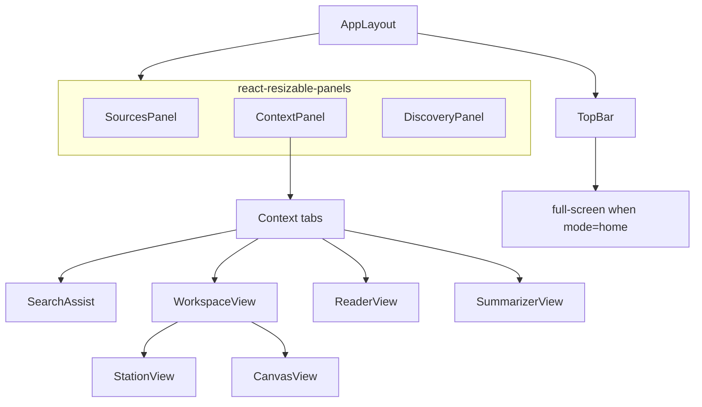

# Client (React frontend)

> **Audience:** developers | **Status:** complete
> **Source of truth:** `client/src`

The client is a React 19 + Vite single-page app with a three-pane resizable layout. It uses
Zustand for state and dnd-kit for drag-and-drop. There is no router library — navigation is a
single `contextMode` string in the UI store.

---

## Layout

- `AppLayout.jsx` composes `SourcesPanel` / `ContextPanel` / `DiscoveryPanel`
  (`client/src/layouts/AppLayout.jsx`). Any panel can expand to full width.
- When `contextMode === "home"`, `HomeView` renders full-screen instead of `TopBar` + panels.
- `ContextPanel` hosts the four context tabs (SearchAssist, Workspace, Reader, Summarizer).
- `WorkspaceView` is itself a tab switcher between **Station** and **Canvas**.

## View routing (`uiStore.contextMode`)

| Mode | View |
|---|---|
| `home` | HomeView — quick search, workspace list, profile picker |
| `search-assist` | SearchAssist — AI overview over search results |
| `workspace` | WorkspaceView — station + canvas tabs |
| `reader` | ReaderView — article / image / video reader |
| `summarizer` | SummarizerView — LLM summary |

Transitions are triggered by `uiStore` actions such as `openReader(url, title, mediaUrl)`.

## State management (Zustand stores)

| Store | Holds | Persisted |
|---|---|---|
| `sessionStore` | `sessionId` (attached to every API call as `X-Session-Id`) | localStorage |
| `uiStore` | `contextMode`, `panelOrder`, `theme`, `expandedPanel`, reader/summarizer targets | — |
| `searchStore` | query, results, images, videos, news, suggestions, infobox, pagination, provider | — |
| `contentStore` | reads, summaries, overviews (query → LLM overview cache) | localStorage |
| `workspaceStore` | workspaces, active workspace, items, chat messages | — |
| `workspaceStationStore` | station data: reads, notes, highlights, pins, images, videos, tags, comparisons, timeline, stats | — |
| `canvasStore` | canvas nodes/connections (currently unused — CanvasView manages its own state) | — |

## Key flows

### Search
`searchStore.search` fires 5 parallel requests: main results, images, videos, news, and
suggestions (`client/src/stores/searchStore.js:38`). Main results render in `SourcesPanel` with
category filters, pagination, and bulk transfer; media/news/infobox render in `DiscoveryPanel`.

*<TBD: screenshot>*

### Transferring results to a workspace
- **Drag-and-drop** — cards are `useDraggable` with payload `{ type: "search-result", result }`.
  `App.jsx`'s `handleDragEnd` reads the payload and calls `workspaceStore.addItem` into the active
  workspace (`client/src/App.jsx:49`).
- **Click +** — adds a single result.
- **Transfer all** — `searchStore.collectTransferSources` dedupes across result sets by URL, then
  `addItemsBulk` reports created / duplicates / rejected.

> Demo: <video controls width="720" src="../assets/videos/search-drag-drop.mp4">
>   <a href="../assets/videos/search-drag-drop.mp4">Download drag-and-drop demo</a>
> </video>
> *<TBD: video>*

### Workspace, station, canvas
- **Station** — item cards with pin / summarize / read / open actions, inline summaries, notes
  section, and a compare panel. Reads, highlights, comparisons, tags, and timeline have API
  coverage but limited UI today.
- **Canvas** — `CanvasView` auto-populates nodes from station items on load, then supports custom
  mouse-based drag, pan, wheel zoom, connections, inline notes, minimap, and fit-to-screen.

*<TBD: screenshot>*

### Reader / Summarizer
`ReaderView` fetches `/api/read` (article/image/video), stores results into persisted
`contentStore.reads`. `SummarizerView` POSTs `/api/summarize` into `contentStore.summaries`.

## API layer

`client/src/api/` mirrors the backend: `search.js`, `chat.js`, `history.js`, `llm.js`, `profile.js`,
`reader.js`, `workspace.js`, `workspaceStation.js`, `canvas.js`. All requests go through
`apiFetch` (`client/src/api/client.js`), which injects the session header. The Vite dev server
proxies `/api` to `http://127.0.0.1:8000` (`vite.config.js`).

## Known dead code

`dnd/handlers.js`, `stores/canvasStore.js`, `components/ReaderModal.jsx`, and
`components/MediaCard.jsx` are not imported anywhere. See [known-issues](known-issues.md).

## Related documentation

- [API Reference](api-reference.md) — endpoints the client calls
- [Usage guide](usage.md) — end-user walkthrough
- [Architecture](architecture.md) — where the client fits
