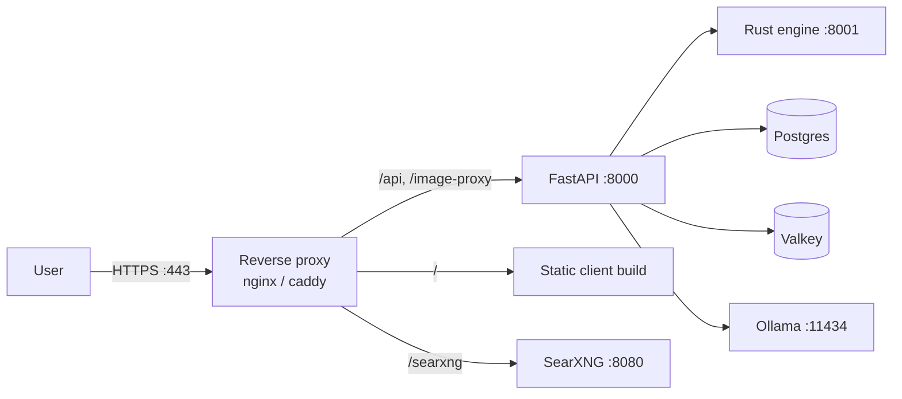

# Deployment

> **Audience:** ops | **Status:** complete
> **Source of truth:** `launch.sh`, `infra/docker-compose.yml`, `server/src/core/config.py`

The default `launch.sh` flow is a developer setup. This doc describes how to run QWRY in
production: process management, reverse proxy, environment checklist, and backups.

---

## Component topology (production)



## 1. Build artifacts

```bash
# Frontend → static files in client/dist
cd client && npm ci && npm run build

# Engine → release binary
cargo build --release --manifest-path engine/Cargo.toml --bin indexer
```

The client `dist/` is served by the web server; the Vite dev proxy no longer applies, so
`VITE_API_BASE_URL` is ignored in production builds today — your reverse proxy must route `/api` to
the FastAPI server.

## 2. Process management (systemd)

Run each service under systemd with `Restart=always`. Example unit for the server:

```ini
[Unit]
Description=QWRY FastAPI server
After=network.target postgresql.service

[Service]
User=qwry
WorkingDirectory=/opt/qwry
EnvironmentFile=/opt/qwry/.env
ExecStart=/opt/qwry/server/.venv/bin/uvicorn server.src.main:app --host 127.0.0.1 --port 8000 --workers 4
Restart=always

[Install]
WantedBy=multi-user.target
```

Repeat for the engine (`indexer ... serve --port 8001`) and, if you crawl continuously, a crawler
worker (one-shot or a queue consumer). Remember `--embed`/`--rerank` on the engine to enable vector
search and reranking.

## 3. Reverse proxy

Terminate TLS and proxy requests. nginx example:

```nginx
server {
    listen 443 ssl;
    server_name search.example.com;
    # ssl_certificate / ssl_certificate_key ...

    root /opt/qwry/client/dist;

    location /api/ {
        proxy_pass http://127.0.0.1:8000;
        proxy_set_header Host $host;
    }
    location /image-proxy {
        proxy_pass http://127.0.0.1:8000/api/image-proxy;
    }
    location / {
        try_files $uri /index.html;
    }
}
```

## 4. Environment checklist

- [ ] `ENVIRONMENT=production`
- [ ] Strong `SEARXNG_SECRET` (not the default)
- [ ] Postgres credentials not committed; `DATABASE_URL` from a secret store
- [ ] Ollama reachable on `OLLAMA_BASE_URL`; model pulled (`ollama pull gemma3:1b`)
- [ ] Valkey password/auth if exposed (currently no auth is configured)
- [ ] `CORS_ALLOWED_ORIGINS` matches your origin (or proxy same-origin)
- [ ] Crawler/indexer configured and run periodically (cron or systemd timer)

## 5. Backups

- **Postgres** — `pg_dump` the whole database (workspaces, station data, history). Alembic
  `upgrade head` on restore.
- **Tantivy index** — regenerable from Postgres via `indexer reindex`; backup optional.
- **Config** — `.env`, `infra/searxng/settings.yml`, `infra/docker-compose.yml`.

## 6. Security notes

QWRY has **no authentication** — every request is scoped only by a client-supplied session id.
Expose it behind a VPN/SSO or your own auth layer, and never put it directly on the public
internet. Details in [security](security.md).

## Related documentation

- [Getting Started](getting-started.md) — dev-mode startup
- [Configuration](configuration.md) — full env reference
- [Security](security.md) — threat model and hardening
