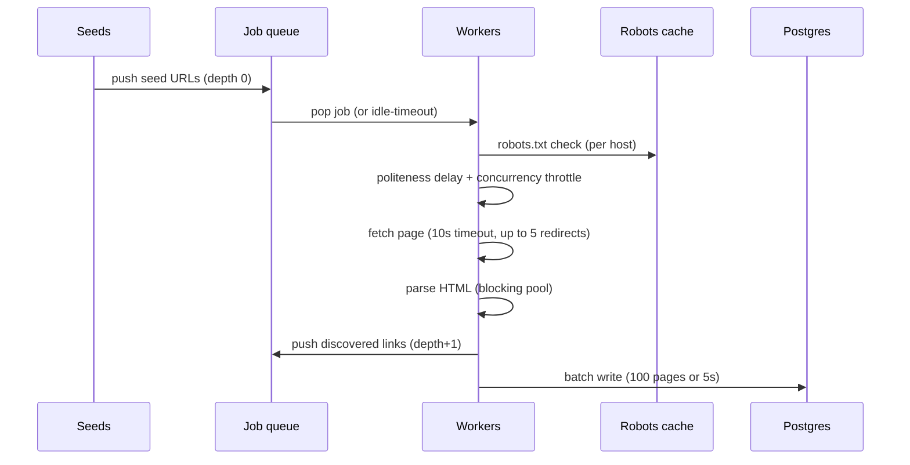
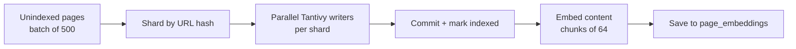

# Engine (Rust crawler + indexer)

> **Audience:** developers | **Status:** complete
> **Source of truth:** `engine/` (workspace with `shared`, `crawler`, `indexer` crates)

The engine is a Rust workspace that (a) politely crawls the web into Postgres and (b) builds a
Tantivy search index over the crawled pages, serving BM25 / vector / hybrid search over HTTP on
port 8001.

---

## Crates

| Crate | Role |
|---|---|
| `shared` | Postgres access: `crawled_pages` + `page_embeddings` tables, batch upserts, brute-force vector search |
| `crawler` | Discovery + fetch loop with robots.txt, politeness, retries, batched DB writes |
| `indexer` | Tantivy indexing, embeddings, search (BM25/vector/hybrid), reranking, HTTP API |

All crates share the same Postgres database (`DATABASE_URL`).

## Crawl lifecycle



Key behaviors (`crawler/src/core/engine.rs`):

- **Politeness** — per-host `Crawl-delay` overrides the global delay; default
  `politeness_delay_secs = 1.0`.
- **Robots.txt** — fetched once per host; prefix matching only (no `*`/`$` wildcards); always
  fetched over `https` (http-only hosts default to allow-all).
- **max_pages** — atomic counter; when reached the crawler shuts down.
- **Retries** — exponential backoff with error classification. Note: 5xx status errors are currently
  classified as permanent (see [known-issues](known-issues.md)).
- **Batch writes** — pages flow through an mpsc channel into a `BatchWriter` that flushes
  100 rows or every 5s.
- **Distributed mode** (`--distributed`) — swaps the in-memory queue for a Postgres-backed
  `crawl_jobs` table with `FOR UPDATE SKIP LOCKED` claiming.

## Indexing pipeline



`ShardedIndex` (`indexer/src/services/sharded.rs`):

- Tantivy schema: `url` (STRING|STORED), `title`, `description`, `content` (TEXT|STORED).
- Single-shard index at `engine/data/index`; multi-shard under `shard-{i}/`.
- Pages are marked `indexed` immediately after Tantivy commit, so a crash never leaves a page
  stuck unindexed.
- Embeddings: BGE-small-en-v1.5 (384 dims); only chunk 0 is generated today. Vector search is a
  brute-force cosine scan over all stored embeddings (fine for demos, not for scale).

## Search modes & fusion

`GET /search` accepts `mode=bm25|vector|hybrid` (alias `semantic` → vector).

| Mode | Method |
|---|---|
| BM25 | Tantivy query parser over title/desc/content (boosts 2.5 / 1.5 / 1.0) |
| Vector | Query embedding + brute-force cosine over `page_embeddings` |
| Hybrid | Fusion of BM25 + vector rankings |

Fusion defaults to **RRF** (`k=60`); when custom `alpha`/`beta` are supplied, weighted score fusion
is used instead:

```
score(url) = alpha * bm25_norm(url) + beta * vec_norm(url)
```

An optional cross-encoder reranker (BGE-reranker-base, `--rerank`) re-ranks the top 30 candidates.

## HTTP API (port 8001)

| Endpoint | Params | Response |
|---|---|---|
| `GET /health` | — | `{"status":"ok"}` |
| `GET /status` | — | page/index/embedding counts, shard stats, model names |
| `GET /search` | `q`, `limit` (≤100), `offset`, `mode`, `rerank`, `alpha`, `beta` | `{ total_hits, hits: [{url, title, description, snippet, score}], query, limit, offset, mode, reranked }` |

## CLI

Built as `indexer` (`cargo build --release`). Commands:

| Command | Purpose |
|---|---|
| `indexer --index-dir PATH --shards N [--embed] [--rerank] index` | Index unindexed DB pages |
| `indexer --index-dir PATH --shards N [--embed] [--rerank] reindex` | Wipe + rebuild the whole index |
| `indexer --index-dir PATH --shards N [--embed] [--rerank] search QUERY [--mode bm25\|vector\|hybrid]` | CLI search |
| `indexer --index-dir PATH --shards N [--embed] [--rerank] serve --port 8001` | Run the HTTP API |

`--embed` and `--rerank` load the ONNX models on startup and are required for vector search /
reranking to work.

## Known limitations

See [known-issues](known-issues.md) for the full list. Highlights: 5xx errors retried as permanent;
distributed retries lost (`ON CONFLICT DO NOTHING` against claimed rows); dedup across nodes is
in-memory only; `qwry.toml` is not parsed by any binary.

## Related documentation

- [Architecture](architecture.md) — where the engine fits
- [Configuration](configuration.md) — env vars + CLI flags
- [Database](database.md) — `crawled_pages` / `page_embeddings` schema
