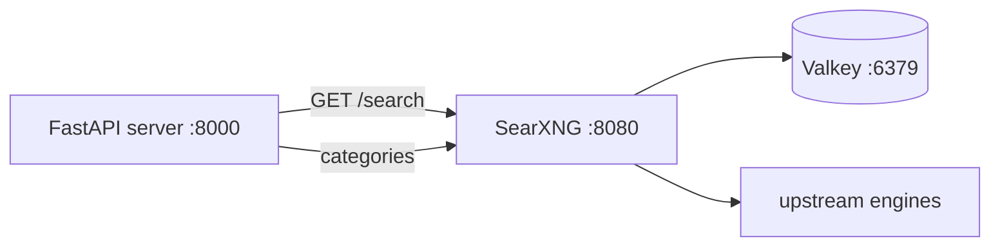

# SearXNG Integration

> **Audience:** users & ops | **Status:** complete
> **Source of truth:** `infra/docker-compose.yml`, `infra/searxng/settings.yml`,
> `server/src/services/searxng.py`

SearXNG is the metasearch provider: it aggregates results from upstream engines (Google, Bing,
Wikipedia, etc.) behind a single self-hosted endpoint, which keeps QWRY free of third-party API
keys.

---

## What QWRY uses it for

| Feature | Endpoint used | Notes |
|---|---|---|
| Web results | `GET /search?format=json` | pageno, categories, infoboxes |
| Suggestions | `/autocompleter`, `/search` suggestions | plus title fallback |
| Images / videos / news | `GET /search?categories=...` | passed through as categories |
| Infobox | `GET /search?format=json` | parsed from `infoboxes[]` |

## How it runs

SearXNG is containerized with Docker Compose (`infra/docker-compose.yml`), profile `searxng`,
together with Valkey (used as a SearXNG cache/limiter store on port 6379):

```bash
./launch.sh --searxng        # or included in --all
# docker compose -f infra/docker-compose.yml --profile searxng up -d
```



Configuration is mounted from `infra/searxng/settings.yml` (JSON format enabled, image proxy on,
limiter off) and overridden by env vars:

| Env | Default | Description |
|---|---|---|
| `SEARXNG_PORT` | `8080` | Host port |
| `SEARXNG_SECRET` | `change-this-before-production` | Signing secret |
| `SEARXNG_VERSION` | `latest` | Docker image tag |
| `SEARXNG_WORKERS` | `2` | uWSGI workers |

## Health checking

- Docker healthcheck: `wget --spider http://127.0.0.1:8080/healthz` (interval 30s).
- `launch.sh` additionally probes `/search?q=test&format=json` and prints any
  `unresponsive_engines` it finds.
- The server's `/api/stats` pings `/healthz` (falling back to a search ping).

## Common failure: upstream engines unreachable

SearXNG can start while all upstream engines fail. Symptoms:

```
SearXNG upstream engines unreachable:
  google: timeout
  bing: timeout
```

This is almost always **DNS/networking inside the container** (SearXNG's default DNS can't reach
upstreams). Fixes:

1. Check container logs: `docker logs <searxng-container-id>`.
2. Provide working DNS — e.g. run the container with
   `--dns 1.1.1.1 --dns 8.8.8.8` (or set DNS in the Compose file).
3. Verify the host itself can resolve: `curl https://www.google.com`.

See [troubleshooting](troubleshooting.md) for more.

## Related documentation

- [Configuration](configuration.md) — server-side SearXNG env vars
- [Deployment](deployment.md) — hardening a production SearXNG
- [Troubleshooting](troubleshooting.md) — engine-unreachable FAQ
