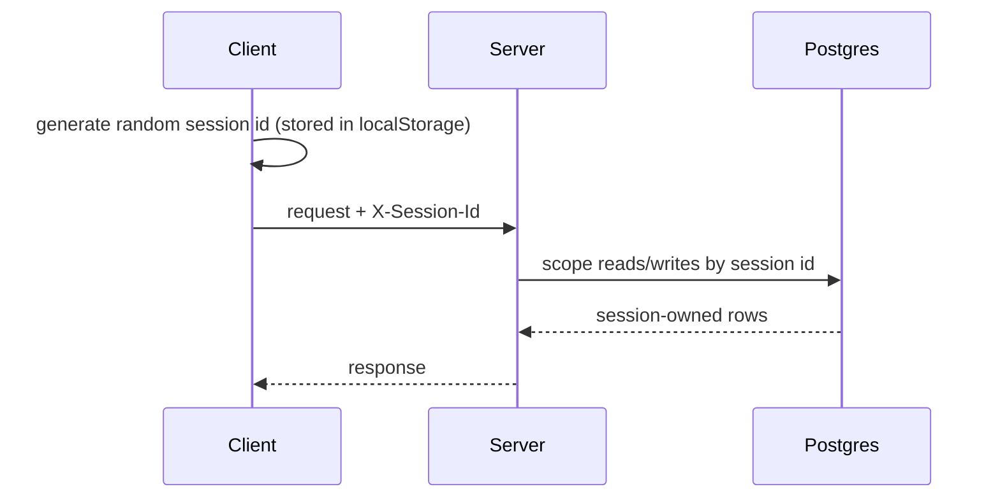

# Security

> **Audience:** ops & developers | **Status:** complete
> **Source of truth:** `server/src/core/session.py`, `server/src/api/*`, `server/src/db/*`

QWRY currently has **no authentication**. This document describes the trust model, where the gaps
are, and how to harden a deployment.

---

## Session model

Identity is a client-generated id sent as the `X-Session-Id` header
(`server/src/core/session.py`):

- If the header is absent, handlers generate a random id that is never reused — effectively a
  guest request.
- There are **no passwords, tokens, or user accounts**. Anyone who knows (or guesses) a session id
  can access that session's workspaces, history, and profile.
- Profiles are meant to be *shared workstations*: `POST /api/profiles` issues a fresh session id,
  and all sessions live side by side with no isolation boundary.

## Data exposure

| Data | Scoped by | Notes |
|---|---|---|
| Workspaces, items, chat | `session_id` | Workspace rows carry nullable `session_id` |
| History (search/reads/summaries/overviews) | `session_id` | |
| Profile | `session_id` (PK) | |
| Station entities, canvas | workspace (via `session_id` on list/create) | ⚠️ update/delete paths often bypass this |
| Engine index | none | Index is shared, read-only via engine API |

## Known gaps (see [known-issues](known-issues.md))

1. **Update/delete without ownership checks** — canvas node/connection deletes, and station/AI/task
   update+delete endpoints, resolve entries by UUID alone without verifying the owning workspace or
   session. Any session that can guess a UUID can mutate/delete it.
2. **Drop target not validated (client)** — dropping a search result anywhere adds it to the active
   workspace; cosmetic, not a server issue.
3. **Image proxy is an open SSRF-adjacent proxy** — `GET /api/image-proxy?url=` fetches any URL and
   returns the bytes. Useful for embedding images, but it can reach internal addresses; restrict
   outbound access or validate URLs in hardened deployments.
4. **CORS** — configurable, defaults to localhost origins only.

## Hardening recommendations

- **Do not expose on the public internet.** Run behind a VPN or reverse-proxy SSO.
- **Lock down the image proxy** — allowlist schemes/hosts, or run the server with no outbound access
  to internal IPs.
- **Restrict network egress** for the FastAPI server to: SearXNG, engine, Ollama, Valkey, Postgres,
  and the public internet (for reading URLs).
- **Set a strong `SEARXNG_SECRET`** and replace any default secrets.
- **Valkey** — currently unauthenticated; bind to loopback or add `requirepass`.
- **Add real auth** if multi-user: the schema mostly keys off `session_id`, so a middleware that
  derives `session_id` from an authenticated identity would slot in cleanly.

## Related documentation

- [Deployment](deployment.md) — production setup
- [Known Issues](known-issues.md) — the ownership gaps in detail
