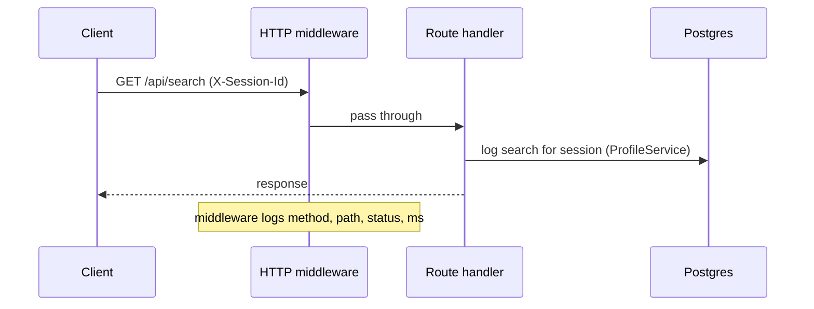

# Server (FastAPI backend)

> **Audience:** developers | **Status:** complete
> **Source of truth:** `server/src` (entry point `server/src/main.py`)

The FastAPI backend (port 8000) is the orchestrator: it accepts requests from the client, fans out
to SearXNG and the Rust engine, persists data to Postgres, caches to Valkey, and calls Ollama for
LLM features. This doc covers structure, services, session model, and cache.

---

## Package layout

```
server/src/
├── main.py                 # app factory, lifespan, CORS, request logging
├── api/
│   ├── router.py           # route registration (all endpoints)
│   ├── endpoints.py        # request handlers
│   └── schemas.py          # pydantic request/response models
├── core/
│   ├── config.py           # pydantic-settings env config
│   ├── registry.py         # searxng/engine endpoint registry
│   ├── session.py          # X-Session-Id handling
│   └── logging.py          # logging setup
├── db/
│   ├── models.py           # SQLAlchemy models
│   ├── repository.py       # data-access repos
│   ├── dependencies.py
│   └── __init__.py         # engine + init_db (create_all)
└── services/
    ├── search_orch.py      # search orchestrator (hybrid merge)
    ├── searxng.py          # SearXNG client
    ├── engine_proxy.py     # Rust engine client
    ├── cache.py            # Valkey cache
    ├── reader.py           # article/image/video extraction
    ├── summarizer.py       # LLM summaries
    ├── llm.py              # Ollama backend
    ├── chat.py             # workspace chat (RAG over items)
    ├── workspace_service.py
    ├── workspace_station_service.py
    ├── canvas_service.py
    ├── profile_service.py
    ├── ai_response_service.py
    ├── task_service.py
    └── stats_service.py    # /api/stats collection
```

## Request lifecycle



Every handler reads a per-request DB session from `app.state.db` (an async sessionmaker) and, when
needed, a shared `httpx.AsyncClient` from `app.state.http`. Long-lived singletons are created in the
lifespan: `CacheService`, `SearchOrchestrator`, `Summarizer`, `ReaderService`, and the LLM backend
(`server/src/main.py:24`).

## Session model

There is **no authentication**. Identity is a client-generated session id sent as the
`X-Session-Id` header (`server/src/core/session.py`). If absent, handlers generate a random one
(which is useless for persistence, since the client won't reuse it). History, profiles, and
workspace ownership are all scoped by this id. See [security](security.md) for implications.

## Search orchestration

`SearchOrchestrator` (`server/src/services/search_orch.py`) dispatches on provider:

| Provider | Behavior |
|---|---|
| `searxng` | Web results via `SearxngClient` |
| `engine` | Local index via `EngineClient` (BM25/vector/hybrid) |
| `hybrid` / `all` | Both concurrently, merged and deduped by URL |

Results are cached under `qwry:search:{q|page|page_size|provider|categories}` for 300s.

## Content services

- **Reader** (`reader.py`) — detects content type (article / image / YouTube video), extracts
  article text with `trafilatura`, and rejects JS-only boilerplate pages. YouTube pages fall back to
  the meta description. Cached 3600s.
- **Summarizer** (`summarizer.py`) — builds an image/video/article-specific prompt and sends it to
  Ollama; detects filler responses. Cached 3600s.
- **LLM** (`llm.py`) — `OllamaBackend` posts to `/api/generate`; the only supported provider.
  Overview responses cached 1800s.
- **Chat** (`chat.py`) — stateless RAG: reads up to 5 workspace items (articles via ReaderService,
  images/videos as labels), truncates to 500 chars, prompts the LLM with numbered sources. Messages
  are persisted by the endpoint, not fed back to the model.

## Cache

`CacheService` (`cache.py`) wraps Valkey via `redis.asyncio`. It degrades gracefully: if Valkey is
unreachable or `CACHE_ENABLED=false`, every operation no-ops.

| Namespace | Key suffix | TTL |
|---|---|---|
| `search` | `q\|page\|page_size\|provider\|categories` | 300s |
| `summary` | URL | 3600s |
| `reader` | URL | 3600s |
| `llm_overview` | sha256(query\|mode) | 1800s |

## Workspaces, station, canvas

The domain services mirror the REST API:

- `workspace_service.py` — workspace CRUD and items; enforces `MAX_ITEMS_PER_WORKSPACE = 1000`;
  bulk add dedupes case-insensitively.
- `workspace_station_service.py` — reads, highlights, notes, pins, images, videos, comparisons,
  tags, timeline; every create writes a timeline event; `get_stats` currently hardcodes
  `summaries = 0`.
- `canvas_service.py` — canvas nodes and connections (nodes are polymorphic over station objects).
- `ai_response_service.py`, `task_service.py` — simple CRUD passthroughs.

## Configuration

All settings are environment variables read by `server/src/core/config.py` (pydantic-settings).
See [configuration](configuration.md) for the full table.

## Related documentation

- [API Reference](api-reference.md) — every endpoint
- [Database](database.md) — models and migrations
- [Configuration](configuration.md) — env vars
- [Architecture](architecture.md) — how the server fits into the system
