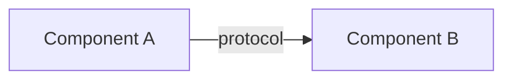

# <Doc Title>

> **Audience:** <users | developers | ops>
> **Status:** <draft | complete>
> **Source of truth:** <file paths / directories this doc describes>

<One-paragraph purpose statement: what this doc covers and why it exists.>

---

## Overview

<Short introduction to the topic. Keep to 3–5 sentences.>

## <Section Heading>

<Body text. Use short paragraphs, bullets, and code blocks. Reference source files like
`server/src/main.py:24` when relevant.>

### Mermaid diagrams

### Screenshots

> Convention: `` followed by an *italic* caption.
> Replace `<TBD: screenshot>` with a real caption once media is captured.

*<TBD: screenshot>*

### Video samples

> Convention: `<video controls>` block with a markdown-link fallback. Media lives in
> `docs/assets/videos/`.

<video controls width="720" src="../assets/videos/search-drag-drop.mp4">
  <a href="../assets/videos/search-drag-drop.mp4">Download demo video</a>
</video>

### Reference tables

| Item | Detail | Source |
|------|--------|--------|
| Example | value | `path/to/file:line` |

## Related documentation

- [docs/README.md](../README.md) — documentation index
- [<Related doc>](../<related-doc>.md) — <what it covers>
